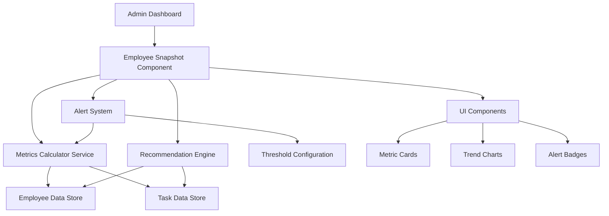

# Design Document: Employee Snapshot Analytics

## Overview

The Employee Snapshot Analytics feature provides administrators with a comprehensive, data-driven interface for viewing employee performance, workload, and task assignment optimization. The system integrates with existing employee and task data structures to calculate real-time metrics, historical trends, and intelligent recommendations.

The design follows a modular architecture with clear separation between data calculation, state management, and UI presentation. It extends the existing React-based frontend with new components, utility functions, and context providers while maintaining consistency with the current design system.

## Architecture

### High-Level Architecture



### Component Hierarchy

```
AdminDashboard
├── EmployeeSnapshotPanel
│   ├── EmployeeSelector
│   ├── BasicInfoCard
│   ├── WorkloadCard
│   │   ├── ActiveTasksMetric
│   │   ├── WorkloadIndicator
│   │   └── AvailabilityStatus
│   ├── ProductivityCard
│   │   ├── CompletionTimeMetric
│   │   ├── OnTimeRateMetric
│   │   └── OvertimeIndicator
│   ├── SkillMatchCard
│   │   ├── SkillTagList
│   │   ├── SimilarTasksMetric
│   │   └── LearningCurveIndicator
│   ├── TaskAssignmentPanel
│   │   ├── TaskComplexitySelector
│   │   ├── CapacityComparison
│   │   ├── DeadlineSuggestion
│   │   ├── RiskIndicator
│   │   └── EmployeeRecommendation
│   ├── TaskProgressTracker
│   │   ├── TaskStateDisplay
│   │   ├── ProgressBar
│   │   └── VelocityMetric
│   ├── PerformanceTrendsCard
│   │   ├── TrendChart
│   │   └── TrendIndicator
│   └── AlertsPanel
│       └── AlertBadge[]
└── TeamStatisticsPanel
    ├── TaskDistributionChart
    ├── BottlenecksList
    └── TopPerformersList
```


## Components and Interfaces

### Core Services

#### MetricsCalculator

Responsible for calculating all employee and task metrics.

```typescript
interface MetricsCalculator {
  // Workload calculations
  calculateWorkloadLevel(employee: Employee): WorkloadLevel;
  calculateTasksDueThisWeek(tasks: Task[]): number;
  calculateAverageDailyHours(timeEntries: TimeEntry[]): number;
  
  // Productivity calculations
  calculateAverageCompletionTime(tasks: Task[]): number;
  calculateOnTimeRate(tasks: Task[]): number;
  calculateOverdueRatio(tasks: Task[]): number;
  calculateIdleVsProductiveTime(timeEntries: TimeEntry[]): TimeBreakdown;
  calculateOvertimeFrequency(timeEntries: TimeEntry[]): OvertimeLevel;
  
  // Performance calculations
  calculateTaskSuccessRatio(tasks: Task[]): number;
  calculateDeadlineAdherence(tasks: Task[]): number;
  calculateConsistencyScore(performanceHistory: PerformanceData[]): number;
  calculateDependencyRisk(tasks: Task[], dependencies: Dependency[]): number;
  
  // Behavioral calculations
  identifyPeakProductivityHours(timeEntries: TimeEntry[]): string;
  calculateContextSwitchingFrequency(activityLog: Activity[]): number;
  calculateBurnoutRisk(employee: Employee): RiskLevel;
  
  // Task progress calculations
  calculateTaskVelocity(task: Task): number;
  calculateDelayProbability(task: Task): number;
  calculateBufferTime(task: Task): number;
}
```

#### RecommendationEngine

Provides intelligent task assignment recommendations.

```typescript
interface RecommendationEngine {
  recommendEmployee(
    task: TaskAssignment,
    employees: Employee[]
  ): EmployeeRecommendation[];
  
  calculateSkillMatch(
    employeeSkills: Skill[],
    taskRequirements: string[]
  ): SkillMatchScore;
  
  suggestDeadline(
    task: TaskAssignment,
    employee: Employee
  ): Date;
  
  assessTaskRisk(
    task: TaskAssignment,
    employee: Employee
  ): RiskAssessment;
  
  findSimilarTasks(
    task: TaskAssignment,
    taskHistory: Task[]
  ): Task[];
}
```

#### AlertSystem

Monitors thresholds and generates proactive alerts.

```typescript
interface AlertSystem {
  checkOverloadWarning(employee: Employee): Alert | null;
  checkDelayPattern(employee: Employee, tasks: Task[]): Alert | null;
  checkUnderUtilization(employee: Employee): Alert | null;
  checkSkillMismatch(employee: Employee, task: Task): Alert | null;
  checkPerformanceDecline(employee: Employee): Alert | null;
  
  getAllAlerts(employee: Employee): Alert[];
}
```


### React Components

#### EmployeeSnapshotPanel

Main container component for displaying employee analytics.

```typescript
interface EmployeeSnapshotPanelProps {
  employeeId: string;
  onTaskAssign?: (task: TaskAssignment) => void;
}

const EmployeeSnapshotPanel: React.FC<EmployeeSnapshotPanelProps> = ({
  employeeId,
  onTaskAssign
}) => {
  const employee = useEmployee(employeeId);
  const tasks = useEmployeeTasks(employeeId);
  const metrics = useMetrics(employee, tasks);
  const alerts = useAlerts(employee);
  
  return (
    <div className="employee-snapshot">
      <BasicInfoCard employee={employee} />
      <WorkloadCard metrics={metrics.workload} />
      <ProductivityCard metrics={metrics.productivity} />
      <PerformanceTrendsCard trends={metrics.trends} />
      <AlertsPanel alerts={alerts} />
    </div>
  );
};
```

#### TaskAssignmentPanel

Component for intelligent task assignment with recommendations.

```typescript
interface TaskAssignmentPanelProps {
  task: TaskAssignment;
  employees: Employee[];
  onAssign: (employeeId: string, task: TaskAssignment) => void;
}

const TaskAssignmentPanel: React.FC<TaskAssignmentPanelProps> = ({
  task,
  employees,
  onAssign
}) => {
  const recommendations = useRecommendations(task, employees);
  const [selectedEmployee, setSelectedEmployee] = useState<string | null>(null);
  
  const riskAssessment = selectedEmployee
    ? assessTaskRisk(task, employees.find(e => e.id === selectedEmployee))
    : null;
  
  return (
    <div className="task-assignment-panel">
      <TaskComplexityDisplay complexity={task.complexity} />
      <EmployeeRecommendationList recommendations={recommendations} />
      {selectedEmployee && (
        <>
          <CapacityComparison employee={selectedEmployee} task={task} />
          <RiskIndicator risk={riskAssessment} />
          <DeadlineSuggestion suggestion={suggestDeadline(task, selectedEmployee)} />
        </>
      )}
    </div>
  );
};
```

#### TeamStatisticsPanel

Aggregated team-level analytics dashboard.

```typescript
interface TeamStatisticsPanelProps {
  teamId: string;
}

const TeamStatisticsPanel: React.FC<TeamStatisticsPanelProps> = ({ teamId }) => {
  const team = useTeam(teamId);
  const stats = useTeamStatistics(team);
  
  return (
    <div className="team-statistics">
      <TaskDistributionChart distribution={stats.taskDistribution} />
      <BottlenecksList employees={stats.bottlenecks} />
      <TopPerformersList employees={stats.topPerformers} />
      <BacklogHealthIndicator health={stats.backlogHealth} />
    </div>
  );
};
```


## Data Models

### Employee

Extended employee model with analytics data.

```typescript
interface Employee {
  id: string;
  name: string;
  email: string;
  role: string;
  department: string;
  employeeId: string;
  manager: string;
  joinDate: string;
  experienceLevel: ExperienceLevel;
  currentStatus: EmployeeStatus;
  
  workload: WorkloadMetrics;
  productivity: ProductivityMetrics;
  skills: Skill[];
  performance: PerformanceMetrics;
  quality: QualityMetrics;
  behavior: BehavioralMetrics;
  taskHistory: TaskHistoryMetrics;
}

type ExperienceLevel = 'Junior' | 'Mid' | 'Senior' | 'Lead';
type EmployeeStatus = 'Present' | 'WFH' | 'On Leave' | 'Sick';
```

### Metrics Types

```typescript
interface WorkloadMetrics {
  activeTasks: number;
  tasksDueThisWeek: number;
  workloadLevel: WorkloadLevel;
  avgDailyHours: number;
  capacity: number; // percentage
  availableHours: number;
}

type WorkloadLevel = 'Low' | 'Balanced' | 'High' | 'Overloaded';

interface ProductivityMetrics {
  avgCompletionTime: number; // days
  onTimeRate: number; // percentage
  overdueRate: number; // percentage
  idleTime: number; // percentage
  productiveTime: number; // percentage
  overtimeFrequency: OvertimeLevel;
  taskVelocity: number; // tasks per week
  focusScore: number; // percentage
}

type OvertimeLevel = 'Low' | 'Medium' | 'High';

interface PerformanceMetrics {
  weeklyCompletionRate: number;
  monthlyCompletionRate: number;
  trend: TrendDirection;
  reliabilityScore: number;
  consistencyScore: number;
  successRate: number;
  deadlineAdherence: number;
  qualityScore: number;
}

type TrendDirection = 'improving' | 'stable' | 'declining';

interface QualityMetrics {
  reworkCount: number;
  avgReviewScore: number; // out of 5
  bugCount: number;
  approvalRate: number; // percentage
}

interface BehavioralMetrics {
  peakHours: string;
  focusTimePattern: string;
  contextSwitching: ContextSwitchLevel;
  burnoutRisk: RiskLevel;
  collaborationScore: number;
}

type ContextSwitchLevel = 'Low' | 'Medium' | 'High';
type RiskLevel = 'Low' | 'Medium' | 'High';

interface Skill {
  name: string;
  level: SkillLevel;
  yearsExp: number;
}

type SkillLevel = 'New' | 'Comfortable' | 'Expert';
```

### Task Assignment Types

```typescript
interface TaskAssignment {
  title: string;
  description: string;
  category: string;
  priority: Priority;
  complexity: ComplexityLevel;
  estimatedHours: number;
  dueDate: Date;
  requiredSkills: string[];
}

type Priority = 'Low' | 'Medium' | 'High';
type ComplexityLevel = 'Low' | 'Medium' | 'High';

interface EmployeeRecommendation {
  employee: Employee;
  score: number;
  matchReasons: string[];
  riskLevel: RiskLevel;
  suggestedDeadline: Date;
}

interface RiskAssessment {
  level: RiskLevel;
  score: number;
  factors: string[];
}

interface SkillMatchScore {
  percentage: number;
  matchedSkills: Skill[];
  missingSkills: string[];
  learningCurve: SkillLevel;
}
```

### Alert Types

```typescript
interface Alert {
  id: string;
  type: AlertType;
  severity: AlertSeverity;
  message: string;
  employeeId: string;
  timestamp: Date;
  actionable: boolean;
  suggestion?: string;
}

type AlertType = 
  | 'overload'
  | 'frequent_delays'
  | 'under_utilization'
  | 'skill_mismatch'
  | 'performance_decline';

type AlertSeverity = 'info' | 'warning' | 'critical';
```


## Correctness Properties

*A property is a characteristic or behavior that should hold true across all valid executions of a system—essentially, a formal statement about what the system should do. Properties serve as the bridge between human-readable specifications and machine-verifiable correctness guarantees.*

### Property 1: Employee Information Completeness

*For any* employee object, when rendered in the snapshot view, the display SHALL include name, role, department, experience level, and reporting manager.

**Validates: Requirements 1.1, 1.2, 1.3, 1.4**

### Property 2: Workload Metrics Display Completeness

*For any* employee with workload data, the system SHALL display active task count, tasks due this week, workload level indicator, current status, and average daily hours.

**Validates: Requirements 2.1, 2.2, 2.3, 2.4, 2.5**

### Property 3: Workload Level Categorization

*For any* employee, the calculated workload level SHALL be exactly one of: Low, Balanced, High, or Overloaded, and SHALL be consistent with the employee's capacity and active task count.

**Validates: Requirements 2.3**

### Property 4: Productivity Metrics Calculation Accuracy

*For any* employee with task history, all productivity metrics (average completion time, on-time rate, overdue ratio, idle vs productive time, overtime frequency) SHALL be calculated correctly based on the task and time entry data.

**Validates: Requirements 3.1, 3.2, 3.3, 3.4, 3.5**

### Property 5: Percentage Metrics Bounds

*For any* calculated percentage metric (on-time rate, overdue ratio, capacity, etc.), the value SHALL be between 0 and 100 inclusive.

**Validates: Requirements 3.2, 3.3, 8.2, 10.2**

### Property 6: Skill Matching Accuracy

*For any* employee-task pairing, the displayed skill tags SHALL only include skills that match the task requirements, and the match count SHALL equal the number of matching skills.

**Validates: Requirements 4.1**

### Property 7: Similar Tasks Count Accuracy

*For any* employee and task category, the count of past similar tasks SHALL equal the number of completed tasks in the employee's history that match the category.

**Validates: Requirements 4.2**

### Property 8: Learning Curve Indicator Validity

*For any* employee-task skill match, the learning curve indicator SHALL be exactly one of: New, Comfortable, or Expert, based on the employee's skill level and experience.

**Validates: Requirements 4.4**

### Property 9: Task Complexity Validity

*For any* task, the complexity level SHALL be exactly one of: Low, Medium, or High.

**Validates: Requirements 5.1**

### Property 10: Capacity Comparison Accuracy

*For any* task assignment, when comparing estimated effort against employee capacity, the system SHALL correctly calculate whether the employee has sufficient available hours.

**Validates: Requirements 5.2**

### Property 11: Deadline Suggestion Reasonableness

*For any* task and employee combination, the suggested deadline SHALL be after the current date and SHALL account for the employee's available capacity and task complexity.

**Validates: Requirements 5.3**

### Property 12: Risk Indicator Validity

*For any* task assignment, the risk indicator SHALL be exactly one of: Low risk, Possible delay, or High risk, and SHALL be based on workload, capacity, performance history, and deadline factors.

**Validates: Requirements 5.4**

### Property 13: Employee Recommendation Ranking

*For any* task and employee pool, the recommended employees SHALL be ranked by score in descending order, and all recommended employees SHALL be valid members of the pool.

**Validates: Requirements 5.5**

### Property 14: Task State Validity

*For any* task, the displayed state SHALL be exactly one of: Not Started, In Progress, Review, or Completed.

**Validates: Requirements 6.1**

### Property 15: Task Progress Bounds

*For any* task, the percentage completion SHALL be between 0 and 100 inclusive, and SHALL be 100 if and only if the task state is Completed.

**Validates: Requirements 6.2**

### Property 16: Time Calculation Accuracy

*For any* task with activity logs, the calculated time spent SHALL equal the sum of all time entries for that task.

**Validates: Requirements 6.4**

### Property 17: Buffer Time Calculation

*For any* task with a deadline, the remaining buffer time SHALL equal the time between now and the deadline minus the estimated remaining work time.

**Validates: Requirements 7.3**

### Property 18: Task Velocity Non-Negativity

*For any* task, the calculated velocity SHALL be non-negative and SHALL increase when progress increases over time.

**Validates: Requirements 7.4**

### Property 19: Quality Metrics Display Completeness

*For any* task, the quality metrics display SHALL include rework count, review feedback score, and approval status. For technical tasks, it SHALL also include bug count.

**Validates: Requirements 8.1, 8.2, 8.3, 8.4**

### Property 20: Review Score Bounds

*For any* task with reviews, the average review score SHALL be between 0 and 5 inclusive.

**Validates: Requirements 8.2**

### Property 21: Performance Trend Calculation

*For any* employee with historical performance data, the trend indicator SHALL be exactly one of: improving, stable, or declining, based on comparing recent performance to historical averages.

**Validates: Requirements 9.3**

### Property 22: Reliability Metrics Calculation Accuracy

*For any* employee with task history, all reliability metrics (success ratio, deadline adherence, consistency score, dependency risk) SHALL be calculated correctly from the task completion and dependency data.

**Validates: Requirements 10.1, 10.2, 10.3, 10.4**

### Property 23: Peak Hours Identification

*For any* employee with time tracking data, the identified peak productivity hours SHALL correspond to the time range with the highest average productivity score.

**Validates: Requirements 11.2**

### Property 24: Burnout Risk Calculation

*For any* employee, the burnout risk indicator SHALL be exactly one of: Low, Medium, or High, and SHALL be based on overtime frequency, workload level, and task completion patterns.

**Validates: Requirements 11.4**

### Property 25: Alert Generation Conditions

*For any* employee, alerts SHALL be generated if and only if the corresponding threshold conditions are met (overload, frequent delays, under-utilization, skill mismatch, or performance decline).

**Validates: Requirements 12.1, 12.2, 12.3, 12.4, 12.5**

### Property 26: Alert Severity Consistency

*For any* generated alert, the severity level SHALL be consistent with the alert type and the magnitude of the threshold violation.

**Validates: Requirements 12.1, 12.2, 12.3, 12.4, 12.5**

### Property 27: Team Statistics Aggregation Accuracy

*For any* team, all team-level statistics (task distribution, bottleneck identification, top performers, backlog health, average cycle time) SHALL be correctly calculated from the aggregated employee and task data.

**Validates: Requirements 13.1, 13.2, 13.3, 13.4, 13.5**

### Property 28: Bottleneck Identification Logic

*For any* team, employees identified as bottlenecks SHALL have either high workload levels, frequent task delays, or high dependency risk scores.

**Validates: Requirements 13.2**

### Property 29: Top Performer Identification Logic

*For any* team, employees identified as top performers SHALL have above-average reliability scores, success rates, and deadline adherence.

**Validates: Requirements 13.3**

### Property 30: Color Coding Consistency

*For any* metric display with color-coded indicators, the color SHALL be consistent with the metric's status or risk level (e.g., green for low risk, yellow for medium, red for high).

**Validates: Requirements 14.1**

### Property 31: Contextual Information Presence

*For any* displayed numerical metric, the system SHALL provide contextual information such as labels, units, or comparison baselines to aid interpretation.

**Validates: Requirements 14.4**


## Error Handling

### Input Validation

1. **Employee ID Validation**: Verify employee exists before fetching data
   - Return error state if employee not found
   - Display user-friendly message: "Employee not found"

2. **Date Range Validation**: Ensure date ranges are valid for historical queries
   - Start date must be before end date
   - Dates cannot be in the future for historical data

3. **Metric Calculation Guards**: Handle edge cases in calculations
   - Division by zero: Return 0 or null for rates when denominator is 0
   - Empty data sets: Return appropriate default values or "N/A"
   - Invalid data: Log warning and skip invalid entries

### Error States

1. **Data Loading Errors**
   - Display loading skeleton while fetching data
   - Show error message if fetch fails
   - Provide retry button

2. **Calculation Errors**
   - Catch exceptions in metric calculations
   - Log errors for debugging
   - Display fallback values or "Unable to calculate"

3. **Missing Data Handling**
   - Display "No data available" for missing metrics
   - Show partial data when some metrics are unavailable
   - Indicate which data is missing

### Boundary Conditions

1. **New Employees**: Handle employees with no task history
   - Display "Insufficient data" for historical metrics
   - Show only current workload and availability

2. **Zero Tasks**: Handle employees with no assigned tasks
   - Show workload as "Low" with 0 active tasks
   - Display "No tasks assigned" message

3. **Extreme Values**: Handle outlier data gracefully
   - Cap displayed percentages at 100%
   - Show "99+" for very high counts
   - Use scientific notation for very large numbers

## Testing Strategy

### Unit Testing

Unit tests will verify specific examples, edge cases, and error conditions for individual functions and components.

**Focus Areas:**
- Metric calculation functions with known inputs/outputs
- Edge cases: empty data, zero values, null inputs
- Error conditions: invalid dates, missing required fields
- Component rendering with mock data
- Alert generation logic with threshold boundary values

**Example Unit Tests:**
- `calculateWorkloadLevel` returns "Low" for 0-2 tasks, "Balanced" for 3-5, "High" for 6-8
- `calculateOnTimeRate` returns 0 when no tasks completed
- `EmployeeSnapshotPanel` renders without crashing with valid employee data
- Alert system generates overload warning when capacity exceeds 90%

### Property-Based Testing

Property-based tests will verify universal properties across all inputs using randomized test data.

**Testing Library**: fast-check (for JavaScript/TypeScript)

**Configuration**: Minimum 100 iterations per property test

**Test Tagging Format**: Each test will include a comment:
```javascript
// Feature: employee-snapshot-analytics, Property N: [property description]
```

**Focus Areas:**
- Metric calculations produce valid outputs for any valid employee data
- Percentage metrics always stay within 0-100 bounds
- Categorization functions always return valid enum values
- Ranking and sorting maintain correct order
- Aggregation functions handle any size team

**Example Property Tests:**
- For any employee data, workload level is one of the four valid values
- For any task history, on-time rate is between 0-100
- For any employee pool and task, recommendations are ranked by score
- For any team data, bottleneck identification returns valid employee IDs

### Integration Testing

Integration tests will verify that components work together correctly:
- Data flow from context providers to UI components
- Metric calculations using real data structures
- Alert system integration with metric calculations
- Navigation and drill-down functionality

### Visual Regression Testing

Verify UI consistency:
- Snapshot tests for metric cards
- Color coding consistency across components
- Responsive layout at different screen sizes

